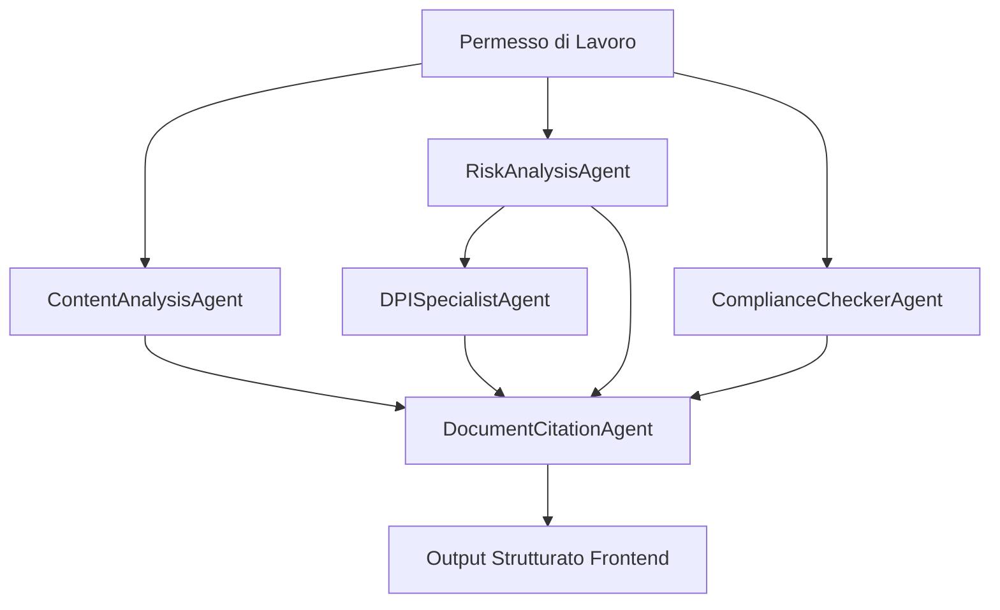

# 🚀 HSE Enterprise System - Backend Multi-Agente

Sistema HSE (Health, Safety, Environment) enterprise completo per la gestione di permessi di lavoro industriali attraverso agenti AI autonomi specializzati.

## 🎯 Caratteristiche Principali

- **Multi-Tenant Architecture**: Isolamento completo dati tra aziende
- **Sistema Multi-Agente AI**: 5 agenti specializzati per analisi HSE
- **Vector-First Search**: Ricerca semantica avanzata con Weaviate
- **RBAC Granulare**: 5 livelli di autorizzazione con permessi specifici
- **Audit Completo**: Log dettagliato di ogni azione per compliance
- **Enterprise Security**: Encryption, rate limiting, session management
- **Scalabilità**: Supporto 1000+ utenti, 10.000+ documenti per tenant

## 🏗️ Architettura del Sistema

```
┌─────────────────┐    ┌──────────────────┐    ┌─────────────────┐
│   Frontend      │◄───┤   FastAPI        │◄───┤  Multi-Agent    │
│   (React)       │    │   Backend        │    │  AI System      │
└─────────────────┘    └──────────────────┘    └─────────────────┘
                                │
        ┌───────────────────────┼───────────────────────┐
        │                       │                       │
┌───────▼────────┐    ┌─────────▼────────┐    ┌────────▼────────┐
│  PostgreSQL    │    │    Weaviate      │    │     MinIO       │
│  Multi-Tenant  │    │ Vector Database  │    │ Object Storage  │
└────────────────┘    └──────────────────┘    └─────────────────┘
```

## 🤖 Sistema Multi-Agente

### Agenti Specializzati

1. **ContentAnalysisAgent** - Analisi qualità contenuti
2. **RiskAnalysisAgent** - Identificazione e valutazione rischi
3. **ComplianceCheckerAgent** - Verifica conformità normative
4. **DPISpecialistAgent** - Raccomandazioni DPI con standard UNI EN
5. **DocumentCitationAgent** - Citazioni strutturate e action items

### Workflow di Analisi



## 🚀 Quick Start

### Prerequisiti

- Docker & Docker Compose
- Python 3.11+
- 8GB RAM minimi
- OpenAI API Key

### Installazione

1. **Clone del repository**
```bash
git clone https://github.com/your-org/hse-agent.git
cd hse-agent
```

2. **Configurazione ambiente**
```bash
cp .env.example .env
# Modifica .env con le tue configurazioni
```

3. **Avvio stack enterprise**
```bash
docker-compose -f docker-compose.enterprise.yml up -d
```

4. **Verifica stato servizi**
```bash
curl http://localhost:8000/health
```

### Accesso Servizi

- **API Backend**: http://localhost:8000
- **API Docs**: http://localhost:8000/api/docs
- **Traefik Dashboard**: http://localhost:8080
- **Grafana**: http://grafana.hse-enterprise.local
- **MinIO Console**: http://minio-console.hse-enterprise.local

## 📊 Database Schema

### Modelli Principali

- **Tenants**: Gestione multi-tenant
- **Users**: Utenti con RBAC
- **WorkPermits**: Permessi di lavoro con analisi AI
- **Documents**: Normative e procedure aziendali
- **AuditLogs**: Log completo per compliance

### Esempio Struttura Tenant

```sql
-- Tenant isolation tramite tenant_id
SELECT * FROM work_permits WHERE tenant_id = 1;
SELECT * FROM documents WHERE tenant_id = 1 AND is_active = true;
```

## 🔐 Sistema Sicurezza

### Livelli RBAC

- **super_admin**: Accesso completo sistema
- **admin**: Gestione tenant completa  
- **manager**: Gestione dipartimento + propri permessi
- **operator**: Solo propri permessi + lettura documenti
- **viewer**: Solo lettura propri permessi

### Permessi Granulari

```python
# Esempi di permessi
"tenant.permits.*"        # Tutti i permessi del tenant
"department.permits.*"    # Permessi del dipartimento
"own.permits.read"        # Lettura propri permessi
"permits.analyze"         # Analisi AI permessi
"documents.upload"        # Upload documenti
```

## 🤖 API Endpoints Principali

### Autenticazione

```bash
# Login
POST /api/v1/auth/login
{
  "username": "admin",
  "password": "password123",
  "tenant_domain": "company.hse-enterprise.local"
}

# Registrazione utente (richiede permessi admin)
POST /api/v1/auth/register
```

### Permessi di Lavoro

```bash
# Crea permesso
POST /api/v1/permits/
{
  "title": "Manutenzione pompa P-101",
  "description": "Sostituzione guarnizioni",
  "work_type": "manutenzione",
  "dpi_required": ["casco", "guanti"]
}

# Analisi AI completa (ENDPOINT PRINCIPALE)
POST /api/v1/permits/{permit_id}/analyze
{
  "force_reanalysis": false,
  "analysis_scope": ["content", "risk", "compliance", "dpi"]
}
```

### Risposta Analisi AI

```json
{
  "analysis_id": "analysis_123456_789",
  "permit_id": 1,
  "confidence_score": 0.85,
  "processing_time": 12.3,
  "executive_summary": {
    "overall_score": 0.8,
    "critical_issues": 3,
    "recommendations": 8,
    "compliance_level": "requires_action"
  },
  "action_items": [
    {
      "id": "ACT_001",
      "type": "dpi_requirement",
      "priority": "alta",
      "title": "Aggiungere guanti protezione chimica",
      "description": "Necessari per protezione da fluidi",
      "suggested_action": "Integrare guanti UNI EN 374",
      "consequences_if_ignored": "Rischio contatto sostanze",
      "frontend_display": {
        "color": "red",
        "icon": "shield-check",
        "category": "DPI Obbligatori"
      }
    }
  ],
  "citations": {
    "normative_framework": [
      {
        "document_info": {
          "code": "D.Lgs 81/2008",
          "title": "Testo Unico Sicurezza Lavoro",
          "authority": "Stato Italiano"
        },
        "key_requirements": [
          {
            "article": "Art. 75",
            "requirement": "Fornitura DPI adeguati",
            "compliance_status": "insufficiente",
            "citation_text": "I DPI devono essere conformi..."
          }
        ]
      }
    ]
  }
}
```

## 📋 Testing

### Struttura Test

```
tests/
├── test_agents.py          # Test sistema multi-agente
├── test_auth.py           # Test autenticazione e RBAC
├── test_permits.py        # Test workflow permessi
├── test_security.py       # Test sicurezza e isolamento tenant
└── conftest.py           # Configurazione pytest
```

### Esecuzione Test

```bash
# Test completi
cd backend && python -m pytest

# Test specifici
python -m pytest tests/test_agents.py -v

# Test con coverage
python -m pytest --cov=app --cov-report=html

# Test solo unità
python -m pytest -m unit

# Test integration
python -m pytest -m integration
```

## 🔄 Deployment

### Single Server

```bash
# Produzione single server
docker-compose -f docker-compose.enterprise.yml up -d
```

### High Availability

```bash
# Cluster ad alta disponibilità
docker-compose -f docker-compose.ha.yml up -d
```

### Kubernetes

```bash
# Deploy su Kubernetes
kubectl apply -f kubernetes/
```

## 📊 Monitoring

### Stack di Monitoraggio

- **Prometheus**: Raccolta metriche
- **Grafana**: Dashboard e visualizzazioni
- **Elasticsearch**: Aggregazione log
- **Kibana**: Analisi log
- **Traefik**: Load balancer e reverse proxy

### Metriche Chiave

- Tempo risposta API
- Performance analisi multi-agente
- Performance query database
- Eventi di sicurezza
- Violazioni isolamento tenant

### Health Checks

```bash
# Verifica salute sistema
curl http://localhost:8000/health

# Informazioni sistema
curl http://localhost:8000/api/v1/system/info
```

## 🔧 Configurazione Avanzata

### Variabili Ambiente

```bash
# Database
DATABASE_URL=postgresql://user:pass@db:5432/hse_db

# AI/ML
OPENAI_API_KEY=your_openai_key
OPENAI_MODEL=gpt-4-turbo-preview

# Vector Database
WEAVIATE_URL=http://weaviate:8080
WEAVIATE_API_KEY=your_weaviate_key

# Security
JWT_SECRET_KEY=ultra_secure_secret_key
JWT_EXPIRATION_HOURS=24

# Rate Limiting
RATE_LIMIT_PER_MINUTE=60
RATE_LIMIT_PER_HOUR=1000
```

### Personalizzazione Agenti

```python
# Configurazione personalizzata agenti
AGENT_CONFIG = {
    "content_analysis": {
        "temperature": 0.1,
        "max_tokens": 4000,
        "timeout": 60
    },
    "risk_analysis": {
        "risk_categories": ["MECH", "CHEM", "BIOL", "PHYS"],
        "severity_levels": 5
    }
}
```

## 📈 Performance

### Requisiti Sistema

| Componente | Minimi | Raccomandati | Enterprise |
|------------|--------|--------------|------------|
| CPU | 4 core | 8 core | 16+ core |
| RAM | 8 GB | 16 GB | 32+ GB |
| Storage | 100 GB | 500 GB | 1+ TB SSD |
| Network | 100 Mbps | 1 Gbps | 10+ Gbps |

### Benchmarks

- **Analisi permesso completa**: < 30 secondi
- **Ricerca documenti**: < 2 secondi  
- **API response time**: < 500ms
- **Concurrent users**: 1000+
- **Documents per tenant**: 10.000+

## 🛠️ Sviluppo

### Struttura Progetto

```
backend/
├── app/
│   ├── agents/          # Agenti AI specializzati
│   ├── config/          # Configurazioni
│   ├── core/           # Security, permissions, tenant
│   ├── models/         # Modelli SQLAlchemy
│   ├── routers/        # API endpoints
│   ├── schemas/        # Pydantic schemas
│   ├── services/       # Business logic
│   ├── middleware/     # Custom middleware
│   └── utils/          # Utilities
├── tests/              # Test suite
├── alembic/           # Database migrations
└── requirements.txt    # Python dependencies
```

### Setup Sviluppo

```bash
# Virtual environment
python -m venv venv
source venv/bin/activate  # Linux/Mac
# o venv\Scripts\activate  # Windows

# Installazione dipendenze
pip install -r backend/requirements.txt

# Database migrations
cd backend
alembic upgrade head

# Avvio sviluppo
uvicorn app.main:app --reload --host 0.0.0.0 --port 8000
```

### Contributing

1. Fork del repository
2. Crea feature branch (`git checkout -b feature/amazing-feature`)
3. Commit modifiche (`git commit -m 'Add amazing feature'`)
4. Push branch (`git push origin feature/amazing-feature`)
5. Apri Pull Request

## 📚 Documentazione

### API Documentation

- **Swagger UI**: http://localhost:8000/api/docs
- **ReDoc**: http://localhost:8000/api/redoc

### Documentazione Agenti

Ogni agente ha documentazione specifica nel codice:

```python
class ContentAnalysisAgent(BaseHSEAgent):
    """
    Agent specializzato nell'analisi della qualità e completezza 
    del contenuto dei permessi di lavoro industriali.
    
    RUOLO: Analizzare la qualità del contenuto del permesso 
           e suggerire miglioramenti specifici.
    """
```

## ⚠️ Sicurezza

### Best Practices

- Cambia **tutti** i secret di default
- Usa HTTPS in produzione
- Implementa backup regolari
- Monitora log di sicurezza
- Aggiorna dipendenze regolarmente

### Audit Trail

Ogni azione è registrata per compliance:

```sql
SELECT * FROM audit_logs 
WHERE tenant_id = 1 
  AND action LIKE 'permit.%' 
  AND created_at > NOW() - INTERVAL '24 hours';
```

## 🐛 Troubleshooting

### Problemi Comuni

1. **Analisi AI lenta**
   - Verifica API key OpenAI
   - Controlla limiti rate limiting
   - Monitora memoria disponibile

2. **Errori database**
   - Verifica connessione PostgreSQL
   - Controlla migrations Alembic
   - Verifica permessi database

3. **Vector search non funziona**
   - Verifica Weaviate status
   - Controlla schema vector database
   - Verifica embedding model

### Log Debug

```bash
# Log applicazione
docker-compose logs -f backend

# Log database
docker-compose logs -f db

# Log Weaviate
docker-compose logs -f weaviate
```

## 📞 Supporto

- **Issues**: [GitHub Issues](https://github.com/your-org/hse-agent/issues)
- **Documentation**: [Wiki](https://github.com/your-org/hse-agent/wiki)
- **Email**: hse-support@your-company.com

## 📄 Licenza

Questo progetto è proprietario. Tutti i diritti riservati.

---

**Sviluppato con ❤️ per la sicurezza industriale**

> Sistema enterprise per aziende che prendono sul serio la sicurezza dei lavoratori e la conformità normativa.